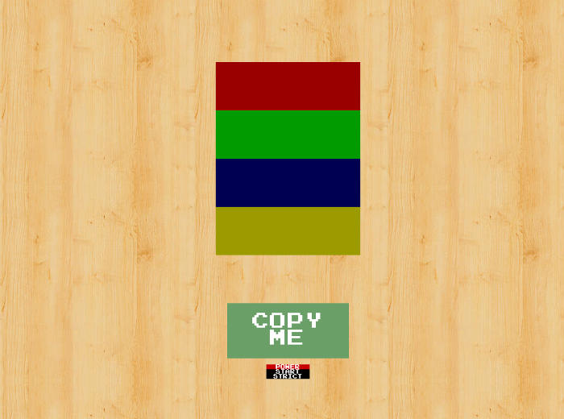
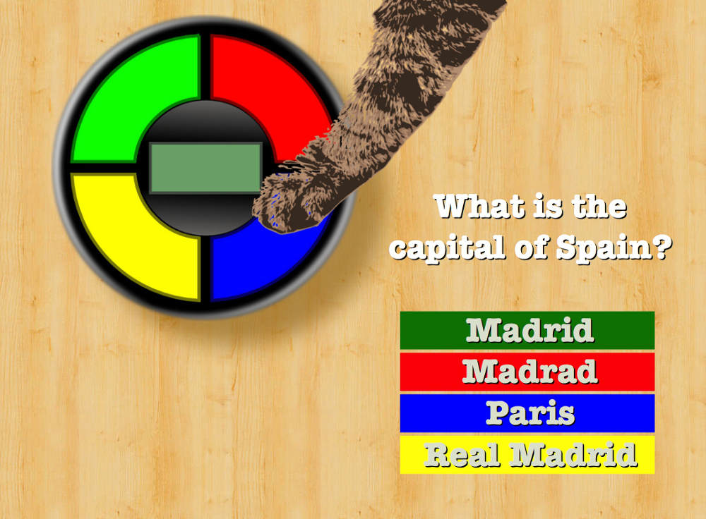

# Simon Game

[Simon](https://www.freecodecamp.com/challenges/build-a-simon-game) is a traditional game re-created for the FreeCodeCamp course.

####User Story:

  * I am presented with a random series of button presses.
Each time I input a series of button presses correctly, I see the same series of button presses but with an additional step.

  * I hear a sound that corresponds to each button both when the series of button presses plays, and when I personally press a button.

  * If I press the wrong button, I am notified that I have done so, and that series of button presses starts again to remind me of the pattern so I can try again.

  * I can see how many steps are in the current series of button presses.

  * If I want to restart, I can hit a button to do so, and the game will return to a single step.

  * I can play in strict mode where if I get a button press wrong, it notifies me that I have done so, and the game restarts at a new random series of button presses.

  * I can win the game by getting a series of 20 steps correct. I am notified of my victory, then the game starts over.

Hint: Here are mp3s you can use for each button: 

[beep 1](https://s3.amazonaws.com/freecodecamp/simonSound1.mp3), [beep 2](https://s3.amazonaws.com/freecodecamp/simonSound2.mp3), [beep 3](https://s3.amazonaws.com/freecodecamp/simonSound3.mp3), [beep 4](https://s3.amazonaws.com/freecodecamp/simonSound4.mp3)

***

In addition to Free code Camps requirements, further aims to focus on both UX and JS were added including:

  * a reasonable UI/UX
  
  * Use Svg

  * Object orientated design
  
  * Sass
  
  * [bourbon](http://bourbon.io) or similar
  
  * Additional game logic design features (See below)
  
  * Use alternative audio samples

Though the game logic hasn't been built yet, the files here are some of the parts of the design so far.

___

A [basic UI](https://appijumbo.github.io/simonGame/) was created 

Game logic can be developed first then using Svg the UI would be improved.

---

##Additional game logic
Rather than just the traditional game, an idea for making it more fun and not a straight Simon clone, was to experiment with when the usr presses the wrong button say, a cats meow is heared and a cat, or cats paw is seen on the game as if accidentaly pressing the buttons.

####Educational role
This could be used in an education role wherby the cat meows (randomly) and its paw appears , then a mmultiple choice question needs to be answered via the Simon UI.

Furthermore player nick names, scores etc. could be stored in localStorage or even on a remote SQL database.

Such a database could also be used to provide a back-end for parents and teachers to analyse the educational performance of players, as well as providing an api for new questions. Security would obviously have to be carefully considered too of course.

  
  
  
  
  

